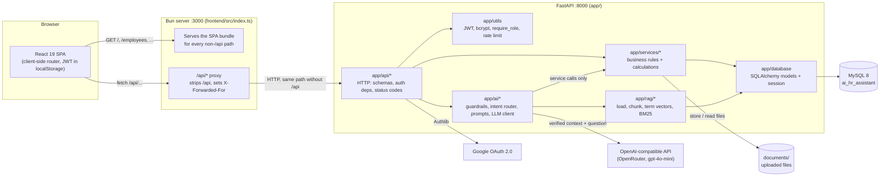
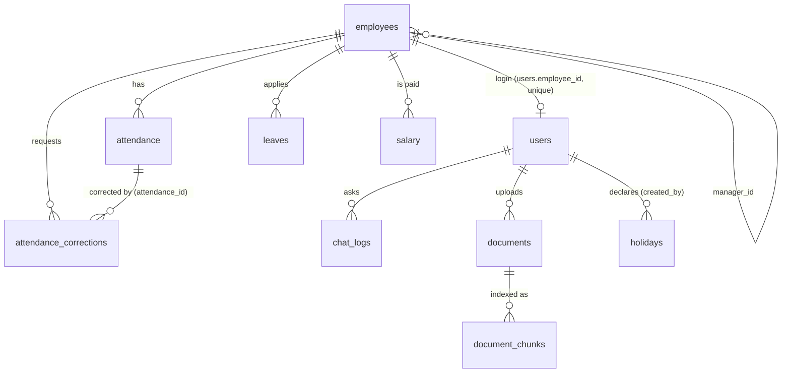
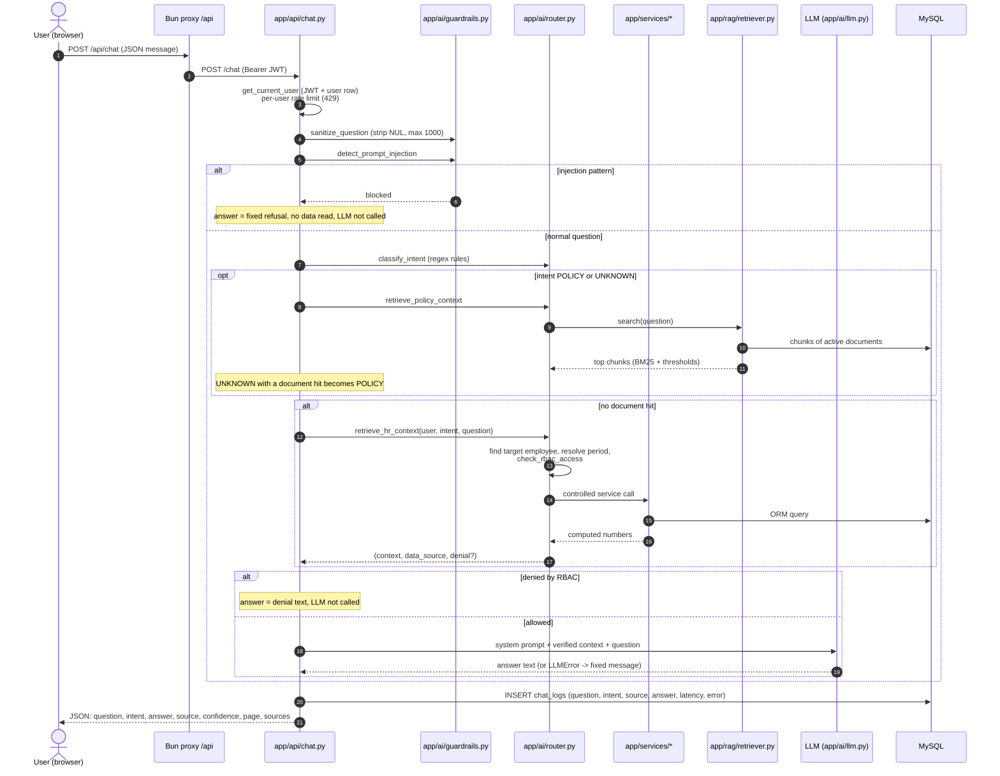

# Architecture

> PRD §33 "Architecture Document". Explains **what each part does, why it exists, how it works and why each library
> was chosen** (PRD §34). Decisions are cited by ID — full text in [`PROJECT_DECISIONS.md`](../PROJECT_DECISIONS.md);
> known problems by KI-ID in [`KNOWN_ISSUES.md`](../KNOWN_ISSUES.md). Companion documents: [`API.md`](API.md) (every
> endpoint, generated from the code) and [`AI.md`](AI.md) (prompts, intents, tools, RAG, guardrails).
> When this document and the code disagree, the code wins — please fix the document.

---

## 1. Overview

The AI HR Assistant is an HRMS (employees, departments, attendance, leave, payroll, documents, reports) whose headline
feature is a chat assistant. A user asks *"How many days was Aman present in August 2024?"* or *"What is the leave
policy?"* and the answer comes from:

- **MySQL**, through Python service functions ("controlled tools") that also enforce the user's permissions — the LLM never
  sees the database, never writes SQL and never does the arithmetic;
- or **uploaded HR documents** (PDF / DOCX / TXT) through a local retrieval pipeline (RAG), with the source document cited.



| Process | Port | Code | Role |
|---|---|---|---|
| Bun server | 3000 | `frontend/src/index.ts` | Serves the React app; forwards `/api/*` to the backend |
| FastAPI (uvicorn) | 8000 | `app/main.py` | REST API + chat endpoint |
| MySQL 8 | 3306 | `alembic/versions/*` define the schema | System of record |
| LLM provider | — | `app/ai/llm.py` | Phrases answers from verified context |

---

## 2. Frontend

**Stack:** Bun 1.4 · React 19 · TypeScript · Tailwind CSS v4 · shadcn-style components on Radix primitives · lucide-react ·
recharts (D-001 explains why React/Bun replaced the PRD's suggested HTML/Bootstrap).

| Concern | How it works | Code |
|---|---|---|
| **Single-page app** | One HTML page; React renders every screen. Bun bundles TS/TSX and Tailwind (`bun-plugin-tailwind`) on the fly in dev (`bun --hot`), and `bun run build` produces a static bundle. | `frontend/src/index.html`, `App.tsx`, `build.ts` |
| **Client-side routing** | A ~80-line History-API router (no dependency): `useRoute()` subscribes to `popstate` + a custom `app:navigate` event, `navigate()` calls `pushState`, `<Link>` intercepts plain left-clicks, `matchPath("/employees/:id")` extracts params. `App.tsx` holds the route table `{pattern, roles, render}`. | `src/lib/router.tsx`, `src/App.tsx` |
| **Bun server + `/api` proxy** (D-003) | `serve({routes: {"/api/*": proxyApi, "/*": index}})`. The proxy strips `/api`, forwards method, query, streamed body and the headers `content-type, authorization, accept, accept-language, cookie`, **overwrites** `X-Forwarded-For` with the real client IP (for the login rate limit, D-031), uses `redirect: "manual"` so OAuth 302s reach the browser, and passes the response through (dropping encoding/length headers Bun already decoded). Backend down -> 502 `{"detail": "Unable to connect to server..."}`. Because the SPA and the API share one origin there is **no CORS** configuration in the backend. | `src/index.ts` |
| **API client** | Every call goes through `lib/api.ts`: prefix `/api`, `Authorization: Bearer <token>`, JSON parsing, FastAPI `detail` -> readable `ApiError` (including 422 validation arrays), 401 -> clear token + redirect to `/login` (except on the login call itself), 429 -> "Too many requests" message. `getPage()` reads `X-Total-Count` (D-035); `download()` saves `.xlsx` files using `Content-Disposition`. | `src/lib/api.ts` |
| **Auth token handling** | `AuthProvider` keeps the JWT in `localStorage` (`hr_token`) and loads the user with `GET /auth/me` on start. Google login is a full-page navigation to `/api/auth/google/login?next=frontend`; the backend finally redirects to `/login#token=<jwt>` and `consumeHashToken()` stores the token and strips the fragment with `history.replaceState` (D-014). Logout = delete the token (JWTs are stateless; see §7.9). | `src/lib/auth.tsx` |
| **Role-gated navigation** | `lib/nav.ts` lists the 11 menu items (Dashboard · My Profile · Employees · Departments · Attendance · Leave · Payroll · Documents · Reports · AI Assistant · Settings) with the role sets the backend enforces; `App.tsx` redirects a role that may not open a route to `/dashboard`. **This is UX only** — every endpoint checks the role and data scope again on the server (§7). | `src/lib/nav.ts`, `src/App.tsx` |
| **Design system** | Tokens (colour, radius, shadow) are CSS variables with light and dark values in `styles/globals.css`; components never use hex colours. Shell = collapsible left sidebar + 56px top bar (breadcrumb, Ctrl/⌘+K command palette, notification bell for approvers, theme toggle). Every data view has loading / empty / error states. Source of truth: [`frontend/DESIGN.md`](../frontend/DESIGN.md) (D-026, D-027; temporary dark-mode legacy bridge D-028). | `styles/globals.css`, `src/components/*` |

Pages live in `src/pages/` (Login, Dashboard, Employees, EmployeeForm, EmployeeDetail, Departments, Attendance, Leave,
Payroll, Documents, Reports, Chat, Settings); shared UI in `src/components/` (`ui/` = Radix-based primitives, `layout/` =
shell); response types in `src/lib/types.ts`.

---

## 3. Backend

**Stack:** Python 3.14 · FastAPI · SQLAlchemy 2 · Pydantic 2 · Alembic · PyMySQL · uvicorn.

### 3.1 Layering (AGENTS.md §2)

```
app/api/*         HTTP only: Pydantic request/response schemas, Depends(get_current_user / require_role),
                  data-scope checks, mapping domain exceptions -> HTTP status codes
      │
      ▼
app/services/*    Business rules and calculations, framework-free (no FastAPI import, no HTTPException).
                  Reused unchanged by the AI router ("controlled tools").
      │
      ▼
app/database/*    models.py (SQLAlchemy 2 declarative models), connection.py (engine + SessionLocal + get_db),
                  queries.py (small CRUD helpers)
```

**Why:** the same function answers the REST call and the chat question, so a number shown on the dashboard and the
number the assistant quotes can never disagree, and permission rules live in one place. Example: attendance
summary = `attendance_service.get_attendance_summary()` -> used by `GET /attendance/summary`, the personal dashboard and
the chat's ATTENDANCE tool.

| Module | Service | Responsibility |
|---|---|---|
| Auth | `auth_service` | Google identity -> local user (match by `google_id`, link by email, or provision an `employee`) |
| Employees / departments | `employee_service` | CRUD, soft delete, **data scope** (`get_scope_employee_ids`, `can_access_employee`, `can_view_salary`), derived departments |
| Attendance | `attendance_service` | Day metrics (late / working / overtime minutes, D-007), check-in/out, summaries, rankings, daily sheet, record search, working-day calendar |
| Corrections | `correction_service` | Correction requests + HR direct edit, paid-month lock (D-033) |
| Holidays | `holiday_service` | National (in code) + declared company holidays (D-034) |
| Leave | `leave_service` | Requests, approval state machine, working-day counting, balances (D-008) |
| Payroll | `salary_service` | Payslips, payroll register, summary, payroll engine (D-021), mark as paid (D-036) |
| Documents | `document_service` | Upload validation, storage, versioning, indexing (RAG ingest), archive |
| Dashboard | `dashboard_service` | HR/Admin KPIs and trends; personal + manager-team overview |
| Reports | `report_service` | openpyxl workbooks (attendance, overtime, leave) |

### 3.2 Domain exceptions -> HTTP codes

Services raise their own exception classes; routers translate them. A service never decides an HTTP status, so it can be
called from a script, a test or the AI router.

| Exception (service) | HTTP | Example |
|---|---|---|
| `EmployeeNotFoundError`, `LeaveNotFoundError`, `DocumentNotFoundError`, `HolidayNotFoundError`, `CorrectionNotFoundError` | 404 | unknown id |
| `EmployeeConflictError`, `DuplicateAttendanceError`, `CheckInError`, `HolidayConflictError`, `CorrectionConflictError`, `CorrectionLockedError` | 409 | duplicate employee code, already checked in, month already paid |
| `EmployeeValidationError`, `LeaveStatusError`, `InvalidSalaryFilterError`, `PayrollPeriodError`, `DocumentValidationError` | 400 | approving a non-pending leave, future payroll month, `.exe` upload |
| `InvalidDateRangeError`, `InvalidLeaveDateError`, `InvalidHolidayError`, `InvalidCorrectionError` | 422 | start after end, weekend holiday, out time before in time |
| `SelfReviewError`, `CorrectionPermissionError` | 403 | reviewing your own correction, manager outside their team |
| `InactiveUserError` / `OAuthAccountConflictError` (auth) | 403 / 409 | Google login of a deactivated account / email linked to another Google id |

Errors always have the FastAPI shape `{"detail": "..."}`; the frontend shows `detail` in a toast.

### 3.3 Request lifecycle

1. `get_db()` opens a SQLAlchemy session per request and closes it afterwards.
2. `get_current_user()` validates the Bearer JWT and **re-loads the user row** (so a role change or deactivation takes
   effect on the next request, even with an old token).
3. `require_role("hr", "admin")` is a dependency factory: the inner `role_checker` closure raises 403 when
   `user.role` is not in the allowed tuple.
4. The handler applies the data scope (e.g. `employee_service.get_scope_employee_ids`) and calls a service.
5. The response is validated against the `response_model` (fields not in the model are dropped — e.g. a password hash
   can never leak through `EmployeeDetailResponse`).

### 3.4 Route-order gotcha

FastAPI matches routes in declaration order. Static paths such as `/attendance/daily`, `/attendance/records`,
`/attendance/corrections`, `/leaves/balance/me` and `/salary/summary` are declared **before** the catch-all
`/{employee_id}` route of the same router; otherwise `"daily"` would be parsed as an `employee_id` and fail with 422.
When adding a static route, put it above the `/{employee_id}` route (the catch-alls are the last route in
`attendance.py`, `leaves.py` and `salary.py`).

### 3.5 Registration

Every router is registered in `app/main.py` (`app.include_router(...)`), which also adds Starlette's `SessionMiddleware`
(signed cookie used only for the Google OAuth state). Interactive OpenAPI docs: `http://localhost:8000/docs`.

---

## 4. Database

**MySQL 8** (`DATABASE_URL=mysql+pymysql://...`), schema managed only by **Alembic** migrations.

### 4.1 Tables



| Table | Purpose | Key columns |
|---|---|---|
| `employees` | HR profile of every person | `employee_code` (unique), `name`, `department` (free text, D-005), `designation`, `joining_date`, `status` (`active`/`inactive`/`terminated`/`on_notice`), `manager_id` -> `employees.id` (self-reference = reporting line), `monthly_gross_salary` (confidential salary structure, D-021) |
| `users` | Login account linked 1:1 to an employee | `employee_id` (unique FK), `email` (unique), `password_hash` (bcrypt, NULL for Google-only accounts), `google_id` (unique, NULL for password-only), `role` (`employee`/`manager`/`hr`/`admin`), `status` (`active`/`inactive`), `created_at`, `updated_at` |
| `attendance` | One row per employee per day | `employee_id`, `attendance_date`, `in_time`, `out_time`, `working_minutes`, `status` (`present`/`absent`/`half_day`/`leave`/`holiday`/`weekend`), `late_minutes`, `overtime_minutes`. One row per (employee, date) is enforced by the services, not by a unique index. |
| `attendance_corrections` | Regularization requests (D-033) | `employee_id`, `attendance_date`, `attendance_id` (record at request time, nullable), `requested_in_time`, `requested_out_time`, `reason`, `status` (`pending`/`approved`/`rejected`/`cancelled`), `requested_at`, `reviewed_by` -> `users.id`, `reviewed_at`, `review_note` |
| `holidays` | Company holidays declared by HR (D-034) | `holiday_date` (unique), `name`, `created_by` -> `users.id`, `created_at`. National holidays are **not** rows — they are `attendance_service.COMPANY_HOLIDAYS` (26 Jan, 15 Aug, 2 Oct) and recur every year. |
| `leaves` | Leave requests | `employee_id`, `leave_type` (`casual`/`sick`/`earned`/`unpaid`/`maternity`/`paternity`), `from_date`, `to_date`, `status` (`pending`/`approved`/`rejected`/`cancelled`), `reason`, `applied_at`, `approved_by` -> `users.id` |
| `salary` | One payslip per employee per month | `employee_id`, `month` (1–12), `year`, `gross_salary`, `pf`, `deductions` (loss-of-pay), `overtime_amount`, `net_salary` (all `NUMERIC(12,2)`), `paid_at` (set = locked, D-036) |
| `documents` | Uploaded HR documents | `name` (display name, versioning key), `file_name` (original), `file_path` (random name on disk), `file_type`, `version`, `status` (`processing`/`active`/`failed`/`archived`), `uploaded_by` -> `users.id`, `upload_date`, `chunk_count`, `error_message` |
| `document_chunks` | RAG index (D-004) | `document_id` (FK, `ON DELETE CASCADE`, indexed), `chunk_index`, `page` (PDF page, NULL otherwise), `content`, `term_vector` (JSON `{term: count}`), `token_count` |
| `chat_logs` | Audit trail of every chat request (PRD §28) | `user_id`, `question`, `detected_intent`, `data_source`, `response`, `timestamp`, `response_time_ms`, `error` |
| `alembic_version` | Current migration revision | — |

### 4.2 Conventions

- **Enums are stored as lowercase strings** (`String(50)` columns) and defined as `str` Enums in
  `app/database/models.py` (`UserRole`, `AttendanceStatus`, `LeaveStatus`, …). Code always writes `Enum.X.value`. Strings
  instead of MySQL `ENUM` keep migrations simple when a value is added (e.g. `on_notice`).
- **Soft delete** (D-006): "deleting" an employee sets `employees.status` and `users.status` to `inactive`; inactive users
  get 403 at login and on every request. Attendance, salary, leave and chat history therefore survive. Documents are
  *archived*, never deleted (D-017). Nothing in the app hard-deletes attendance, salary or chat logs.
- **Derived departments** (D-005): there is no `departments` table; `employee_service.list_departments` groups employees
  by the `department` string (headcount, active count, designations, managers).
- **Money** is `NUMERIC(12,2)`; MySQL `SUM()` returns `Decimal`, which services cast to `int`/`float` before arithmetic.
- **Dates** are `DATE`/`TIME`/`DATETIME` columns (server-local time, no time zone — KI-019).

### 4.3 How database queries work

All queries are built with the SQLAlchemy 2 ORM inside services — no raw SQL strings in the app, so user input is always
sent as bound parameters (no SQL injection). Typical patterns:

```python
# Aggregation in SQL (attendance_service.get_attendance_summary)
db.query(
    func.count(Attendance.id),
    func.sum(case((Attendance.status == "present", 1), else_=0)),
    func.sum(case((Attendance.late_minutes > 0, 1), else_=0)),
    func.sum(Attendance.overtime_minutes),
).filter(Attendance.employee_id == employee_id,
         Attendance.attendance_date >= start, Attendance.attendance_date <= end).one()

# Data scope applied as a filter (employee_service.list_employees)
query = db.query(Employee)
if scope_ids is not None:                    # None = HR/Admin = everyone
    query = query.filter(Employee.id.in_(scope_ids))

# Ranking with GROUP BY + ORDER BY (attendance_service.rank_employees)
db.query(Employee.id, Employee.name, func.sum(Attendance.overtime_minutes).label("ot"))
  .join(Attendance, Attendance.employee_id == Employee.id)
  .group_by(Employee.id).order_by(func.sum(Attendance.overtime_minutes).desc())
```

Rules that need calendars or several tables (working days, leave days, payroll) load the rows and compute in Python —
see `salary_service.calculate_payroll` and `leave_service.count_leave_days`.

### 4.4 Migrations (Alembic)

Chain (`alembic/versions/`, run with `alembic upgrade head`):

| Revision | Change |
|---|---|
| `1b723488096a` | Initial tables: employees, attendance, salary, users, chat_logs, documents, leaves |
| `c0b131e5fbaa` | `users.google_id` (unique) + nullable `password_hash` (Google-only accounts) |
| `d4e5f6a7b8c9` | `document_chunks` table + `documents.error_message` (RAG) |
| `e5f6a7b8c9d0` | `employees.monthly_gross_salary`, back-filled from each employee's latest salary row (D-021) |
| `f6a7b8c9d0e1` (head) | `holidays` and `attendance_corrections` tables (D-033, D-034) |

Never edit tables by hand or call `Base.metadata.create_all` against the real database (AGENTS.md §2.6). The Docker
entrypoint runs `alembic upgrade head` on every start.

### 4.5 Why MySQL

The PRD names MySQL; the data is relational (employees -> attendance/leave/salary, reporting lines, FKs to users) and the
reports are aggregations that SQL does well. It also stores the RAG index (`document_chunks`), so the project needs no
second datastore (D-004).

---

## 5. AI assistant (request flow)

Details (prompt text, every intent and tool, guardrails, confidence values): [`AI.md`](AI.md).



Key properties (PRD §16, §18–20, §28): the LLM only **phrases** a context that Python already computed and
permission-checked; refusals never reach the LLM; every request — including refusals and LLM failures — is logged.

---

## 6. RAG (documents -> answers)

Decision D-004: lexical retrieval over sparse term vectors stored in MySQL, no external vector DB.

| Step | What happens | Code |
|---|---|---|
| 1. Upload | HR/Admin `POST /documents/upload` (multipart). Extension whitelist `pdf/docx/txt`, empty file rejected, max 10 MB (the handler reads at most 10 MB + 1 byte). Stored as `documents/<uuid4>.<ext>` — the client file name is only kept as metadata. A document with the same display name archives the previous version(s) and gets `version = max + 1` (D-017). | `api/documents.py`, `services/document_service.upload_document` |
| 2. Parse | PDF: `pypdf`, one text per page (1-based page numbers kept for citations; encrypted PDFs tried with an empty password). DOCX: `python-docx` paragraphs + table rows (`a \| b`), no page numbers. TXT: UTF-8-sig -> UTF-8 -> latin-1. No extractable text (e.g. scanned PDF, KI-009) -> `DocumentLoadError`. | `rag/document_loader.py` |
| 3. Clean + chunk | Remove control characters, re-join words hyphenated across line breaks, collapse whitespace. Split into paragraphs (long ones into sentences, hard-wrap > 900 chars), greedily pack into chunks of **≤ 900 characters with ~150 characters overlap**, never across a page boundary; chunks < 40 chars are dropped. | `rag/chunker.py` |
| 4. "Embed" | `tokenize`: lowercase -> `[a-z0-9]+` tokens -> drop stopwords (incl. "company", "employee") -> light suffix stemming (`leaves`->`leave`, `policies`->`policy`) -> term counts `{term: n}`. The document name is prepended to each chunk's text so title words match. | `rag/embeddings.py` |
| 5. Store | One `document_chunks` row per chunk: `content`, `page`, `term_vector` (JSON), `token_count`. Document -> `active` with `chunk_count`; on a parse error -> `failed` + `error_message` (the upload still returns 201). | `services/document_service.index_document` |
| 6. Retrieve | For a question: tokenize it the same way, load the vectors of **active** documents only, score each chunk with **Okapi BM25** (`k1=1.5`, `b=0.75`, IDF computed over the chunks of all active documents). Keep a chunk only if it contains ≥ 34 % of the distinct query terms **and** (score ≥ 1.0 **or** ≥ 50 % of the terms with at least 2 matches — needed because IDF is near zero in a tiny corpus). Return the top 4. | `rag/retriever.search` |
| 7. Answer | The chunks become numbered excerpts `[Source i: <name> (<file>, page n)]` in the LLM context with "Answer only from them and mention the document name". The response carries `source` = file name of the best chunk, `page`, and `sources[]` (document, file name, page, score). No hit -> built-in `app/data/policies.json` fallback (D-009). | `ai/router.retrieve_policy_context`, `api/chat.py` |
| Maintenance | `POST /documents/{id}/reindex` re-runs steps 2–5; `DELETE /documents/{id}` archives (chunks deleted, file and row kept). | `api/documents.py` |

**Why not neural embeddings / a vector DB:** OpenRouter has no reliable embeddings endpoint; local embedding models
need torch / sentence-transformers (hundreds of MB); FAISS / Chroma add native dependencies on Windows. An HR handbook is
a few hundred chunks, so BM25 in Python is fast, deterministic, unit-testable and easy to explain. Trade-off: no
synonym matching ("remote work" vs "work from home", KI-010). Swapping in dense embeddings only means replacing
`embeddings.py` and `retriever.py`; the table already isolates the index.

---

## 7. Authentication and security

### 7.1 Passwords

`bcrypt` with work factor 12 (`app/utils/security.py`): each password has its own salt inside the hash; `checkpw` is
constant-time; a malformed or missing hash (Google-only account) is treated as a mismatch. Passwords are never logged or
returned (`UserResponse` exposes only `has_password: bool`).

### 7.2 JWT access tokens

`POST /auth/login` -> `create_access_token(user_id, role)`: PyJWT, **HS256**, claims `sub` (user id), `role`, `iat`, `exp`
(default 60 minutes, `JWT_ACCESS_TOKEN_EXPIRE_MINUTES`). `decode_access_token` requires all four claims and verifies the
signature and expiry. `get_current_user` then loads the user from the database — the **role used for authorization is
the database role**, not the claim, and inactive users are rejected with 403. The secret comes from `JWT_SECRET_KEY`;
`load_secret()` refuses to start the app when it is missing, still the `.env.example` placeholder, or shorter than 32
bytes (D-031; fixes KI-003). Failed logins return the same generic `Invalid email or password.` for an unknown email and a
wrong password (no account enumeration).

### 7.3 Google OAuth 2.0 (Authlib)

```
SPA "Sign in with Google" ──► /api/auth/google/login?next=frontend   (full page navigation through the Bun proxy)
backend: session["oauth_next"]="frontend"; Authlib stores state in the signed session cookie; 302 ──► Google consent
Google ──► GOOGLE_REDIRECT_URI (default <frontend>/api/auth/google/callback via the proxy, D-041; the backend /auth/google/callback also works when it is reachable directly)
backend: exchange code, read userinfo (sub, email, name) ──► auth_service.resolve_or_create_google_user
   google_id known ─► that user · email known without google_id ─► link · email linked to another google_id ─► 409
   unknown ─► new employee profile (department "General") + user with role "employee", password_hash NULL
   inactive ─► 403
backend: create_access_token ──► 302 FRONTEND_URL/login#token=<jwt>   (JSON response when ?next was not given)
SPA: consumeHashToken() stores the token, strips the fragment (history.replaceState), loads /auth/me
```

The token travels in the URL **fragment**, which browsers never send to servers (D-014). The session cookie is signed with
`SESSION_SECRET_KEY` (also enforced ≥ 32 bytes, no fallback — fixes KI-011). The real Google round-trip is still not
verified with a real account (KI-004).

### 7.4 Role model and RBAC matrix

Roles (D-016): `employee`, `manager`, `hr`, `admin`. "Team" = the manager plus employees whose `manager_id` is the
manager's employee id (direct reports only, D-010). The single source of the data scope is
`employee_service.get_scope_employee_ids()` -> `None` (everyone) for HR/Admin, `{self} ∪ direct reports` for managers,
`{self}` for employees.

| Capability | employee | manager | hr | admin | Enforced in |
|---|:-:|:-:|:-:|:-:|---|
| Own profile, attendance, leave, payslips, check-in/out, apply/cancel leave, correction requests | ✅ | ✅ | ✅ | ✅ | `/…/me` routes derive the id from the token |
| Employee directory, employee detail | self | team | all | all | `require_role` + `can_access_employee` |
| Departments, daily attendance sheet, attendance record search | — | team | all | all | `get_scope_employee_ids` |
| Leave list / approve / reject | — | team, **not own** | all, **not own** | all, **not own** | `api/leaves.py` (D-022) |
| Attendance corrections review | — | team, not own | all, not own | all, not own | `correction_service.review_correction` (D-033) |
| Create an attendance record (`POST /attendance`) | — | — | ✅ | ✅ | `require_role("hr","admin")` |
| Edit an attendance record (`PUT /attendance/records/{id}`) | — | — | ✅ not own | ✅ not own | `require_role("hr","admin")` + `SelfReviewError` (D-033) |
| Create / edit / deactivate employees | — | — | ✅ (no admin logins) | ✅ | `api/employees.py` |
| **Another person's salary** (`salary`, `monthly_gross_salary`) | **never** | **never** | ✅ | ✅ | `require_role`, `can_view_salary`, chat `check_rbac_access` |
| Payroll register, generate payroll, mark as paid, salary summary | — | — | ✅ | ✅ | `api/salary.py` |
| Upload / re-index / archive documents, declare holidays | — | — | ✅ | ✅ | `require_role("hr","admin")` |
| Read documents & holiday calendar | ✅ | ✅ | ✅ | ✅ | `get_current_user` |
| Excel reports, HR dashboard | — | — | ✅ | ✅ | `require_role("hr","admin")` |
| Users & roles, chat audit log | — | — | — | ✅ | `require_role("admin")` |
| AI chat | own data + policies | + team attendance/leave, team rankings (D-032), no team salary | HR data, payroll summary | same as HR | `app/ai/router.py` + `guardrails.check_rbac_access` |

Never trusted from the client: "my" data always uses `current_user.employee_id`; an `employee_id` filter outside the
caller's scope returns 403 (e.g. `GET /attendance/records?employee_id=`).

### 7.5 Ownership checks worth knowing

- Nobody approves their own leave or reviews their own correction, **including HR and Admin** (D-022, D-033); HR/Admin
  cannot directly edit their own attendance.
- An admin cannot change their own role or deactivate themself; HR/Admin cannot deactivate their own employee record.
- Only an admin can create a login with role `admin`.
- Attendance of a month whose salary row is paid can no longer be corrected or edited (`ensure_not_paid`, D-033/D-036).
- Cancelling a leave or correction checks that it belongs to the caller (else 404, so ids of other people's requests
  are not confirmed).

### 7.6 Chat guardrails

Prompt-injection regexes run **before** intent detection and refuse for every role without reading data (D-011);
RBAC denials are produced by the controlled tools and are returned **without calling the LLM**; the system prompt forbids
inventing data. Full list in [`AI.md` §6](AI.md#6-guardrails).

### 7.7 Rate limiting (D-031)

`app/utils/rate_limit.py`: in-memory **sliding-window** counters (a deque of timestamps per key, guarded by a lock).

| Limiter | Key | Default | Env var |
|---|---|---|---|
| `login_ip_limiter` | client IP | 30 attempts / 60 s | `RATE_LIMIT_LOGIN_PER_MINUTE` |
| `login_failure_limiter` | `<client IP>\|<email>` | 5 failures / 900 s, reset by a successful login | `RATE_LIMIT_LOGIN_FAILURES`, `RATE_LIMIT_LOGIN_FAILURE_WINDOW_SECONDS` |
| `chat_limiter` | `user:<id>` | 20 messages / 60 s (protects the LLM budget) | `RATE_LIMIT_CHAT_PER_MINUTE` |

Over the limit -> 429 `Too many … Please try again in N seconds.` with `Retry-After`. `RATE_LIMIT_ENABLED=false` turns it
off. The client IP is the TCP peer, unless the peer is in `TRUSTED_PROXY_IPS` (default `127.0.0.1,::1`; in Docker the
frontend container's fixed IP) — only then is the **last** `X-Forwarded-For` entry used. The Bun proxy overwrites that
header with the real client IP, so a browser cannot pick its own IP. Limits are per process and reset on restart, hence
one uvicorn worker (KI-031 is referenced in the code for a shared store; see §7.9).

### 7.8 Secrets, uploads, logging

- **Secrets** only in `.env` (git-ignored; `.env.example` documents every variable). `JWT_SECRET_KEY` and
  `SESSION_SECRET_KEY` must be ≥ 32 bytes and not placeholders, or the backend does not start. The Docker image does not
  contain `.env` (`.dockerignore`); compose passes it as `env_file`.
- **Uploads:** extension whitelist, 10 MB cap, generated storage name (`uuid4().hex`), the client file name is never used
  as a path; downloads are served by id with a fixed media type per extension.
- **Logging:** `chat_logs` stores question, intent, source, answer, latency and an error code
  (`PROMPT_INJECTION_BLOCKED`, `RBAC_ACCESS_DENIED`, LLM error text). Passwords and tokens are never logged; refused
  salary questions log the denial text, not data. There is no other application logging (`app/utils/logging.py` is
  empty); uvicorn's access log records request lines.
- **Validation:** Pydantic models with lengths/ranges on every input (e.g. chat `message` ≤ 1000 characters, employee
  fields, salary ≥ 0); the ORM binds all parameters.

### 7.9 What is NOT protected / known limitations

| Limitation | Notes |
|---|---|
| No token revocation / logout on the server | JWTs are valid until `exp` (60 min). Deactivation and role changes still apply immediately because the user row is re-read on each request. |
| Token stored in `localStorage` | Readable by any script running on the page (XSS would expose it). No refresh tokens. |
| No HTTPS in the app | Put a TLS reverse proxy in front for shared deployments (README "Deployment"). |
| Rate limits are in-memory and per process | Lost on restart; multi-worker or multi-instance deployments need a shared store (Redis) — KI-031. |
| Google sign-in provisions any Google account | An unknown Google user becomes an active `employee` with an empty "General" profile (no allow-list of domains; `email_verified` is not checked). Only relevant when Google OAuth is configured — KI-033. |
| Prompt-injection detection is pattern-based | New phrasings can slip through; the safety net is that data access is still role-checked in Python and the LLM never sees data the user may not see (D-011). |
| Lexical RAG, no OCR | KI-010 (synonyms), KI-009 (scanned PDFs). |
| Any authenticated user can read every active document | By design (D-017): policies are company-wide. Do not upload confidential per-person documents. |
| Server-local clock for check-in and holidays | KI-019; Docker sets `TZ` (default `Asia/Kolkata`). |
| Tests use the dev database | KI-002, mitigated by D-023. |
| Seed accounts share the public password `Demo@12345` | Demo only — deactivate them in a shared deployment. |

---

## 8. Deployment

### Local (development)

```powershell
python -m venv .venv; .venv\Scripts\activate; pip install -r requirements.txt
copy .env.example .env            # DATABASE_URL, JWT_SECRET_KEY / SESSION_SECRET_KEY (>= 32 bytes), LLM_*
alembic upgrade head              # schema
python scripts/seed_db.py         # demo data (Aug–Sep 2024); resets demo rows when run
python scripts/generate_demo_month.py   # current-month demo attendance + leaves (idempotent, D-024)
uvicorn app.main:app --reload --port 8000          # backend (agents: without --reload, KI-022)
cd frontend; bun install; bun dev                  # http://localhost:3000
```

### Docker (`docker-compose.yml`)

| Service | Image | Published | Notes |
|---|---|---|---|
| `db` | `mysql:8.4`, utf8mb4 | no | volume `mysql_data`; healthcheck `mysqladmin ping` |
| `backend` | `Dockerfile` (python:3.14-slim, non-root uid 10001) | no | `docker/backend-entrypoint.sh`: wait for DB -> `alembic upgrade head` -> seed only if `SEED_DEMO_DATA=true` **and** `employees`+`users` are empty -> `uvicorn` (1 worker, no reload). Uploads in volume `documents_data`. `TRUSTED_PROXY_IPS` = the frontend's fixed IP. |
| `frontend` | `frontend/Dockerfile` (oven/bun 1.4, non-root) | `FRONTEND_PORT` (3000) | `NODE_ENV=production bun src/index.ts`, `BACKEND_URL=http://backend:8000`, fixed IP `172.28.0.10` on `hr_net` |

Only the frontend is reachable from the host; the browser reaches the API through `/api`. Step-by-step instructions,
backup and Google OAuth settings: README "Deployment (Docker)".

---

## 9. Testing

- **Standalone scripts** in `tests/` (37 `test_*.py` files) using FastAPI's `TestClient` against the **dev MySQL database**
  from `.env`; each prints `[PASS]/[FAIL]` and exits non-zero on failure. Run all with `python scripts/run_tests.py`
  (optionally filtered by file-name words), one with `python tests/test_x.py`.
- **The database must be byte-identical after a run (D-023):** tests create rows with markers (`T-<AREA>-*` codes,
  `@hrtest.dev` emails, `RAGTEST*` documents) and delete them in `finally`; chat tests use `tests/helpers.TrackingClient`,
  which removes exactly the `chat_logs` rows it caused. Proof: `python scripts/db_snapshot.py save before.json` ->
  run tests -> `python scripts/db_snapshot.py diff before.json` ("Database unchanged"); `isolate` names an offending file.
- **The LLM is always mocked** (`patch("app.api.chat.generate_response")`); tests assert on the verified context the
  router handed to the LLM, and on "LLM not called" for refusals.
- **AI regression bank** `tests/test_question_bank.py` (PRD §30): normal, incorrect, security, calculation and RAG
  questions through `POST /chat`; expected numbers are computed from MySQL inside the test (see [`AI.md` §11](AI.md#11-testing)).
- **Permissions:** `test_rbac_matrix.py`, `test_security*.py`; new endpoints need happy path, 401, 403 and an
  ownership/isolation check (AGENTS.md §5).
- **Frontend:** `bunx tsc --noEmit -p .`, `bun run build`, and the browser QA harness `python scripts/ui_qa.py`
  (Playwright driving the installed Edge, D-020).

---

## 10. Library choices

| Library | Used for | Why this one |
|---|---|---|
| **FastAPI** | HTTP API | Type-hint driven request validation and automatic OpenAPI docs (`/docs`, and `scripts/export_api_docs.py` builds `docs/API.md` from it); dependency injection (`Depends`) makes auth and RBAC reusable per route; fast to write and test with `TestClient`. |
| **uvicorn** | ASGI server | The standard server for FastAPI; one worker keeps the in-memory rate limiter consistent. |
| **SQLAlchemy 2** | ORM / query builder | Typed `Mapped[...]` models, composable queries for scope filters and aggregations, parameter binding (no SQL injection), database-agnostic. |
| **Pydantic 2** | Schemas | Validation and serialization of every request/response; `response_model` guarantees no extra field leaks. |
| **Alembic** | Migrations | Versioned, reviewable schema changes that run automatically in Docker (`upgrade head`); the SQLAlchemy companion tool. |
| **PyMySQL** | MySQL driver | Pure Python — installs on Windows and slim containers without a C compiler. |
| **PyJWT** | Access tokens | Small, focused JWT library; required-claims and expiry validation built in. |
| **bcrypt** | Password hashing | Slow, salted, adaptive hash designed for passwords (work factor 12). |
| **Authlib** | Google OAuth 2.0 / OIDC | Handles the authorization-code flow, state/CSRF via the session, token exchange and ID-token parsing for Starlette. |
| **itsdangerous** (via Starlette `SessionMiddleware`) | Signed OAuth session cookie | Needed by Authlib to keep the OAuth state between login and callback. |
| **httpx** | LLM HTTP client | One `POST /chat/completions` call to any OpenAI-compatible API — no vendor SDK or LangChain needed; easy to mock. |
| **OpenRouter** (OpenAI-compatible API, `openai/gpt-4o-mini`) | Answer phrasing | One API key for many models; switching provider/model is an env change (`LLM_BASE_URL`, `LLM_MODEL`). |
| **openpyxl** | Excel reports | Writes styled `.xlsx` workbooks with several sheets in pure Python. |
| **pypdf** | PDF text extraction | Pure Python, per-page text so answers can cite page numbers. |
| **python-docx** | DOCX text extraction | Reads paragraphs and tables of Word files. |
| **python-multipart** | File uploads | Required by FastAPI for `multipart/form-data`. |
| **python-dotenv** | Configuration | Loads `.env` for local development. |
| **email-validator** | `EmailStr` fields | Pydantic's email validation backend. |
| **Bun** | Frontend runtime, bundler, dev server, proxy | One tool replaces Node + Vite/webpack + Express; built-in TS/JSX, HMR and `serve()` routes for the `/api` proxy. |
| **React 19 + TypeScript** | UI | Component model for a data-heavy SPA; types shared with API responses (`lib/types.ts`). |
| **Tailwind CSS v4** | Styling | Utility classes on top of design tokens (CSS variables) — consistent spacing/colours and light/dark themes without hand-written CSS per page. |
| **Radix UI primitives** (dialog, dropdown, tooltip, popover, switch, select, label, slot) | Accessible widgets | Focus trapping, Escape handling, ARIA and keyboard navigation are hard to hand-roll correctly (D-027). |
| **class-variance-authority, clsx, tailwind-merge** | Component variants | shadcn-style `Button`/`Badge` variants and safe class merging. |
| **lucide-react** | Icons | Consistent tree-shakable SVG icon set (the only icon library allowed). |
| **recharts** | Charts | Declarative React charts for the dashboards (the only chart library allowed). |
| **Playwright** (dev only) | Browser QA | Drives the installed Edge; not an app dependency (D-020). |

**Deliberately not used (D-004):** torch / sentence-transformers (hundreds of MB for embeddings), FAISS / Chroma / any
vector database (native dependencies, a second datastore), LangChain (abstraction not needed for one controlled call),
an OpenAI SDK (httpx suffices). Adding any of these needs a recorded decision.
